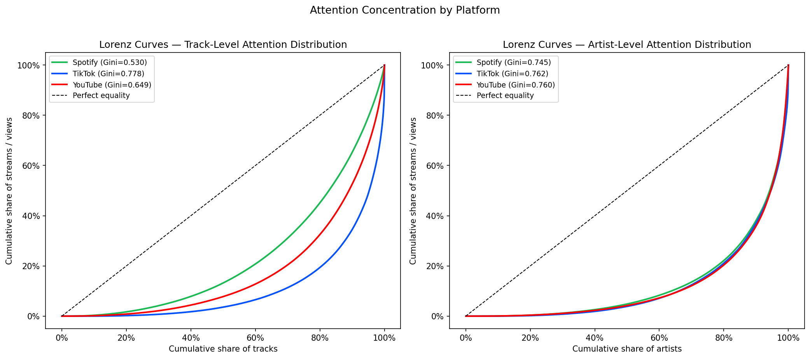
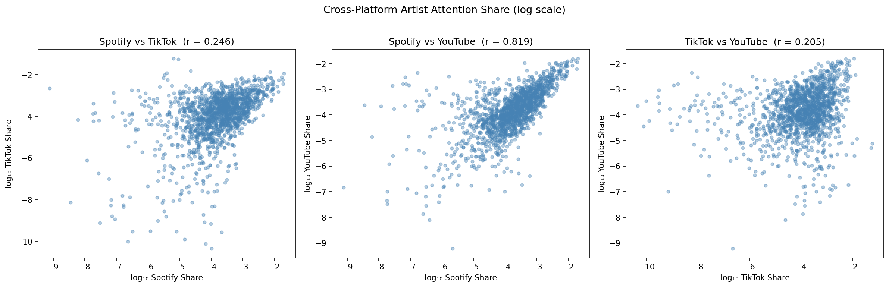
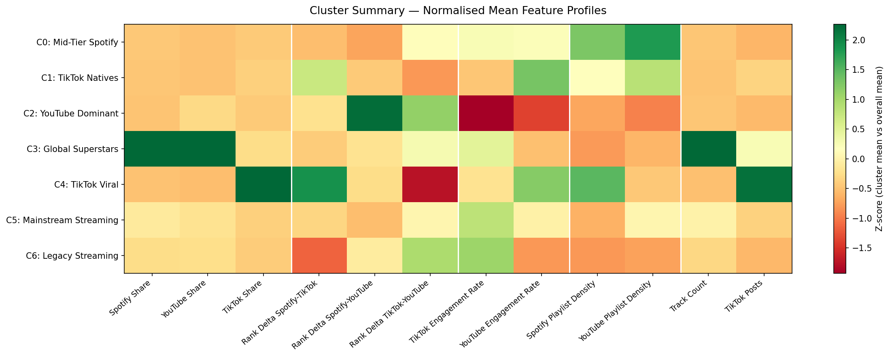

# Attention (In)Equality Across Music Streaming Platforms & Latent Artist Clusters

## Summary

- Analysis of attention distribution across Spotify, TikTok, and YouTube for 3,519 tracks and 1,534 artists.
- Quantifies attention inequality using Gini coefficients and Lorenz curves, borrowing from income distribution economics.
- Identifies seven latent artist archetypes through K-means clustering on cross-platform shares, ranks, and rank deltas.

---

## What is the project about?

Attention is scarce. As music consumption has fragmented across Spotify, TikTok, and YouTube, the question of how that attention is allocated — within platforms and across them — has become central to understanding the modern music economy. Each platform operates a distinct discovery mechanism, and the artists who capture attention on one platform do not necessarily capture it on another.

This project asks whether those cross-platform patterns are random or structural: whether the distribution of attention reveals consistent archetypes in how artists exist across the streaming landscape.

Two complementary approaches are used:

- An **inequality-based lens**, which quantifies how concentrated attention is within each platform using Gini coefficients and Lorenz curves.
- A **clustering-based lens**, which groups artists by their cross-platform attention profiles to surface latent archetypes.

The central question:

> How is attention allocated within and across Spotify, TikTok, and YouTube — and what artist archetypes emerge from the structure of that distribution?

---

## Key Findings

### Attention Inequality

Attention is highly concentrated within every platform. Gini coefficients at track level range from 0.53 (Spotify) to 0.78 (TikTok), and converge at the artist level across all three platforms (0.74–0.76) — suggesting superstar concentration is a feature of the music economy rather than any single platform's algorithm.

The Lorenz curves above make this structure legible (see above). At track level, platform divergence is visually clear — Spotify's curve bows least far from the equality line while TikTok's hugs the axis longest before rising steeply. At artist level the three curves are nearly indistinguishable.

### Cross-Platform Positioning

Cross-platform positioning is strongly consistent between Spotify and YouTube (Pearson r = 0.82 on attention share) but largely decoupled from TikTok (r < 0.25 for both TikTok pairings). TikTok operates as a structurally distinct attention economy — streaming dominance is neither a prerequisite nor a reliable outcome of viral success on the platform.

### Artist Archetypes

Seven artist archetypes emerge from K-means clustering (k=7, selected by silhouette score) on a nine-feature matrix of platform shares, within-platform ranks, and cross-platform rank deltas:

| Cluster | Label | Artists |
|---------|-------|---------|
| C0 | Mid-Tier Spotify | 415 |
| C1 | TikTok Natives | 317 |
| C2 | YouTube Dominant | 143 |
| C3 | Global Superstars | 50 |
| C4 | TikTok Viral | 2 |
| C5 | Mainstream Streaming | 342 |
| C6 | Legacy Streaming | 265 |

Each cluster carries a distinct signature across platform dominance, engagement behaviour, and playlist reach — visible in the normalised heatmap above.

---

## Dataset

Source: https://www.kaggle.com/datasets/nelgiriyewithana/most-streamed-spotify-songs-2024/data

The dataset covers the most-streamed tracks on Spotify in 2024, enriched with cross-platform metrics across TikTok and YouTube.

- **4,600 tracks** in the raw dataset
- **3,519 tracks** retained after dropping records with missing consumption data across all three platforms
- **1,534 unique artists** in the artist-level analytical dataframe

Fields used span streams, views, likes, playlist counts and reach, TikTok posts, and engagement metrics across all three platforms.

---

## Methods

### Attention Distribution
- Gini coefficient computation at track and artist level
- Lorenz curve visualisation by platform
- Cross-platform attention share and rank correlation analysis

### Artist Clustering
- Platform attention share construction and rank delta derivation
- StandardScaler normalisation across nine features
- K-means clustering with silhouette-based k selection (k=7)
- Cluster profiling via engagement ratios, playlist density, and normalised feature heatmaps

---

## Repository Structure

- `data/` — raw dataset file
- `images/` — all visualisations referenced in the README and notebook
- `streaming_attention_analysis.ipynb` — main analysis notebook
- `README.md`

---

## How to Run

1. Create a Python environment (e.g., conda)
2. Install dependencies: `pip install pandas numpy matplotlib scikit-learn scipy`
3. Place the dataset CSV in the `data/` folder
4. Run the notebook from top to bottom